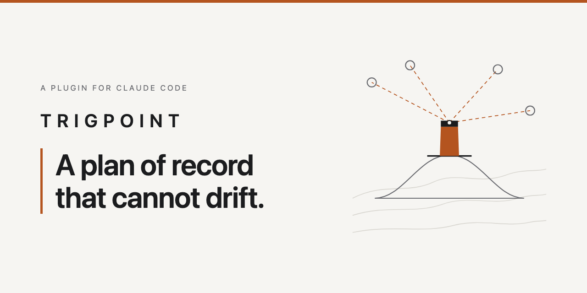

# Trigpoint

**Plans made by an agent go stale within a week, and a stale plan is worse than none, because it
is still consulted.**

Trigpoint is a Claude Code plugin. It audits a codebase, asks four questions in dependency order,
and writes a plan of record whose counts are generated rather than typed and whose ticked boxes
cannot exist without recorded evidence.

A trig point is the fixed concrete pillar on a hilltop that the surrounding landscape is
triangulated from. A known reference that everything else is measured against. That is what the
ledger is for a project.

---

## What you get

- **A plan you can trust the numbers on.** Every count is generated from the task lists. The
  summary at the top of your roadmap cannot quietly disagree with the tasks below it, because
  nobody types it.
- **Progress you can believe.** A ticked box carries the command that was run and what it printed.
  Six months later you can see not just that something was done, but how anyone knew.
- **A plan that survives context resets.** It lives in your repository, not in a chat window. A
  new session, a new machine, or a colleague who has never installed this picks up where the last
  one stopped.
- **Questions grounded in your actual code.** The audit runs first, so the options you are offered
  come from what is really there, not from what a README claims is there.
- **Something to look at, not just read.** A generated dashboard for scanning, alongside the
  markdown for working.

---

## When to reach for it

- **You have inherited a codebase** and need to know what is real before promising anything.
- **A project has gone dormant** and you cannot tell what still works, what half-shipped, and what
  should simply be deleted.
- **An agent wrote you a plan** and a week later you no longer trust it.
- **The work will span many sessions**, so whatever holds the plan has to outlive any one of them.
- **Several people or agents are working in parallel** and you need one place that says what is
  actually done.

It is a poor fit for a small change you can hold in your head, or for a greenfield project with no
existing code to audit. It earns its keep where there is more truth to establish than you can keep
in working memory.

---

## What a run produces

Three linked artefacts. The examples below are not mock-ups: they are this repository's own
`ROADMAP.md`, which Trigpoint's rules govern and whose gate runs against it in CI.

**1. The ledger,** `ROADMAP.md` at the repository root. Tracks, dependencies, every task as a
checkbox, the hand-off contracts, and a falsifiable definition of done. A ticked task carries the
command that was run and what it printed:

```markdown
- [x] **1.2** Write ledger validation: a ticked task with no `**Verified:**` line is an error, a
      duplicate task id is an error, an unknown `**Blocked by:**` reference is a warning
      **Verified:** `python3 -m unittest tests.test_ledger_validate -v` -> `Ran 18 tests in
      0.001s` / `OK`. 2026-08-26

- [ ] **5.2** Publish the plugin to a marketplace and verify a real install from outside this
      checkout
```

**2. The progress table,** generated in place inside that same ledger, between a pair of markers.
Nobody types these numbers. This is the current table from this repository, verbatim:

```markdown
<!-- trigpoint:progress:begin -->
| Track | Scope | Tasks | Done | Blocked by |
| --- | --- | --- | --- | --- |
| **T1 Parser and gate** | The ledger model, its validation rules, and the read-only CI gate built on them | 6 | 6 | nothing |
| **T2 Generation** | The generated progress table, the dashboard renderer, and the sync CLI that writes both | 4 | 4 | T1 |
| **T3 Installation** | The CLAUDE.md instruction block installer | 3 | 3 | T1 |
| **T4 Packaging** | The plugin and marketplace manifests, the slash commands, and the skill with its references and templates | 4 | 4 | T1, T2, T3 |
| **T5 Publication** | The README, the cover art, the published marketplace listing, and a verified real install | 2 | 0 | T4 |
| **Total** | | 19 | 17 | |
<!-- trigpoint:progress:end -->
```

**3. The dashboard,** `roadmap-dashboard.html`, generated from the same parse in the same pass, so
it is structurally incapable of disagreeing with the table above. Plus a design spec recording why
the plan is shaped the way it is.

See [`examples/README.md`](examples/README.md) for what to look at in each.

---

## Install

Both routes below were run on 2026-08-26 and both succeeded.

The shared marketplace, which lists this plugin and any later ones:

```
/plugin marketplace add felipeflorencio/claude-plugins
/plugin install trigpoint@felipeflorencio
```

Or directly from this repository, which carries its own single-entry marketplace manifest:

```
/plugin marketplace add felipeflorencio/trigpoint
/plugin install trigpoint@trigpoint
```

Verified with the `claude plugin` CLI, which takes the same arguments as the slash commands:

```
$ claude plugin marketplace add felipeflorencio/claude-plugins
Successfully added marketplace: felipeflorencio (declared in user settings)

$ claude plugin install trigpoint@felipeflorencio
Successfully installed plugin: trigpoint@felipeflorencio (scope: user)
```

---

## Usage

| Command | What it does |
| --- | --- |
| `/trigpoint` | Runs the whole thing from the beginning: light pass, audit, premise check, the question ladder, design sections, then emits the three artefacts. Any argument is your stated goal for the work. |
| `/trigpoint-sync` | Regenerates the progress table and the dashboard from the ledger. Reports what applied and what did not, separately and verbatim. |

A whole run has **seven interaction touchpoints**, and after the last one the skill never asks
again on that project. "Blocks" means it stops and waits, because only you hold that fact and
guessing it would build the plan on an invented premise.

| # | What | If you say nothing |
| --- | --- | --- |
| - | The premise check. A statement, not a question. | - |
| 1 | Which audit lanes, pre-ticked with reasons drawn from your repo | Runs all seven |
| 2 | How do you run what you already have deployed? | Blocks |
| 3 | What is this work actually aiming at? | Blocks |
| 4 | Half-built areas: deleted, flagged off, or finished? | Blocks |
| 5 | What access do I have, and can I verify the result myself? | Blocks |
| 6 | Section-by-section approval of the design | Blocks |
| 7 | Automatic updates, unless you say otherwise | Automatic |

Silence on question 1 runs all seven audit lanes. Over-cover, never under-cover: a lane skipped by
silence is exactly the gap that later reads as clean. The ledger names which lanes ran and which
did not, so an absent lane never passes for a clean one.

---

## What it guarantees, and the proof

### Counts cannot drift

The progress table is generated, never authored. Hand-edit a number and the next regeneration
overwrites it. Here that is done deliberately, on a scratch copy of this repository's own ledger:
the `Total` row was edited by hand from `19 | 17` to `24 | 22`, then the generator was run.

```
$ grep -n "Total" ROADMAP.md
27:| **Total** | | 24 | 22 | |

$ python3 .trigpoint/build_dashboard.py --ledger ROADMAP.md --output roadmap-dashboard.html
applied: progress table
applied: dashboard html -> roadmap-dashboard.html

$ grep -n "Total" ROADMAP.md
27:| **Total** | | 19 | 17 | |
```

CI closes the loop: `.github/workflows/checks.yml` regenerates both files and then runs
`git diff --exit-code` on them, so a committed count that disagrees with the task lines fails the
build.

### A box cannot be ticked without recorded evidence

`check_drift.py` reads the ledger, writes nothing, and exits non-zero on an error. A ticked task
with no `**Verified:**` line is an error. So is a `**Verified:**` line that still holds an
unfilled `{{ placeholder }}`, because a template someone forgot to fill in is not evidence.

Run against a scratch ledger holding one of each:

```markdown
- [x] **1.1** Wire the export endpoint
- [x] **1.2** Add the retry budget
      **Verified:** {{ command and output }}
```

this is what it printed:

```
$ python3 .trigpoint/check_drift.py ROADMAP.md; echo "exit code: $?"
ERROR  ROADMAP.md:8  task 1.1 is ticked with no **Verified:** line. Record the command that was run and what it printed, or untick it.
ERROR  ROADMAP.md:9  task 1.2 is ticked but its **Verified:** line still contains an unfilled {{ placeholder }}. Record the command that was actually run and what it printed, or untick it.
2 error(s), 0 warning(s) in ROADMAP.md
exit code: 1
```

There is no exemption clause and no configuration for it. An exemption lets an agent decide what
is obvious, and "the change was obvious" is the failure being prevented.

### The instruction survives the plugin

A run installs a delimited block into the target repository's own `CLAUDE.md`, so a future session
in a fresh window keeps the ledger discipline even with the plugin not loaded. Re-running updates
that block in place rather than stacking a second copy.

---

## The worked example

The method comes from one real run against a dormant two-part codebase. The audit put **248
findings** in front of the verification gate; **15** came out CONFIRMED, 3 were sharpened and 1 was
refuted. Only a confirmed finding became a task. The plan that resulted was **67 tasks across 8
tracks**.

---

## Limits

- **It does not replace static analysis.** It establishes ground truth for planning. It is not a
  linter and it is not a type checker; run those too.
- **It is version 0.1.0.** The ledger and the drift gate are covered by 129 tests. The plan it
  hands you is a strong first draft to argue with, not a verdict.

---

## What is in here

| Path | What it is |
| --- | --- |
| `skills/trigpoint/SKILL.md` | The process: audit, then the question ladder, then emit |
| `skills/trigpoint/references/` | The seven audit lanes, the four questions, the evidence rules, the parse contract |
| `scripts/trigpoint_ledger.py` | Parses a ledger's tracks, tasks and definition of done. No filesystem access |
| `scripts/trigpoint_render.py` | Renders the parsed ledger into the progress table and the dashboard HTML |
| `scripts/build_dashboard.py` | Regenerates the progress table in place and writes the dashboard |
| `scripts/check_drift.py` | The read-only CI gate over the same parse |
| `scripts/install_block.py` | Installs the delimited block into a target repository's `CLAUDE.md` |
| `commands/` | The `/trigpoint` and `/trigpoint-sync` slash commands |
| `ROADMAP.md` | This repository's own ledger, kept under its own rules |
| `assets/cover.html` | The source of the cover image, version-controlled rather than a loose binary |

Run the checks locally with `python3 -m unittest discover -s tests` and
`python3 scripts/check_drift.py ROADMAP.md`.
